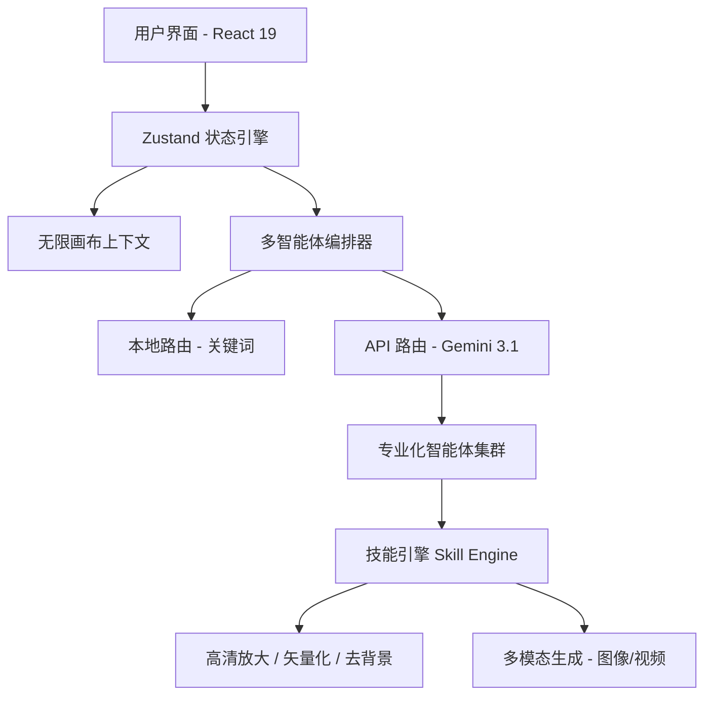

# XC-STUDIO: 下一代 AI 辅助设计工作台

<div align="center">


**XC-STUDIO** 是一款专为专业创作者打造的高级无限画布 AI 设计平台。它集成了多智能体编排协作、先进的多模态生成（图像/视频）以及深度的垂直领域工作流，提供无缝、高性能的 Web 设计体验。

[探索功能](#-核心能力) • [智能体系统](#-多智能体协作系统) • [技术架构](#-技术架构) • [快速开始](#-快速快速)

</div>

---

## 🌟 核心能力

### ♾️ 无限创意画布
专为无约束设计打造的高性能工作空间。
- **多媒体编排**: 无缝融合图像、视频、文本和矢量形状。
- **绝对坐标系统**: 专业级的元素定位与图层管理能力。
- **智能标记系统**: `Ctrl` + 点击可创建高精度选区标记，用于局部 AI 分析、重绘与重绘优化。
- **持久化存储**: 基于 **IndexedDB** 的强大项目管理，突破浏览器存储限制，支持大规模创意资产存储。

### 👔 服装工作室 (垂直领域专业工作流)
专为时尚与电商领域专家设计的深度集成环境。
- **身份锁定 (Identity Lock)**: 确保生成的系列组图中，模特的脸部特征与身材比例高度一致。
- **版型精准 (Garment Precision)**: “产品锚点”系统确保衣服的材质纹理、缝线和结构细节完全忠于原始样衣。
- **自动化镜头规划**: AI 驱动的分镜计划生成，完美匹配亚马逊、Shopify 等全球电商主图标准。

### 🎬 高级视频生成
集成顶级视频模型，支持精确的时长和分辨率控制。
- **模型支持**: **Grok Video (10s/15s)**, **Sora 2.0 Pro**, **Veo 3.1 Fast/Pro**, 以及 **Kling 1.5**。
- **上下文感知生成**: 从画布元素一键转换为视频，或直接根据智能体建议的分镜生成。

---

## 🤖 多智能体协作系统

XC-STUDIO 采用双层路由系统（**本地关键词预匹配 + LLM 语义深度分析**）来精准调用专业 AI 智能体。

| 智能体 | 核心领域 | 主要交付物 |
| :--- | :--- | :--- |
| **Vireo** | 品牌识别 | Logo 系统、VI 规范、品牌配色方案。 |
| **Cameron** | 影视导演 | 高保真故事板、剧本与分镜计划。 |
| **Campaign** | 营销/电商 | 电商主图、详情页、亚马逊/Shopify 营销套图。 |
| **Poster** | 视觉沟通 | 高冲击力的海报、社交媒体封面及平面广告。 |
| **Package** | 工业设计 | 产品包装、开箱视觉、卷轴及标签设计。 |
| **Motion** | 动态媒体 | 逐帧视频生成控制与视觉特效调优。 |

---

## 🏗️ 技术架构

XC-STUDIO 构建于现代化的反应式架构之上，专为低延迟和高可靠性而优化。



- **前端核心**: React 19, TypeScript 5.8, Vite 6.
- **状态管理**: 基于持久化层的 Zustand 分布式状态。
- **AI 后端**: Google Gemini 3.1 (Flash/Pro/Thinking) + 顶级图像/视频提供商。
- **基础设施**: 使用 IndexedDB 实现海量资产云端同步感知的本地持久化。

---

## 🚀 快速开始

### 1. 环境准备与安装
确保您的环境中已安装 Node.js 18+。

```bash
# 克隆仓库
git clone https://github.com/xiaoche0907/XC-STUDIO.git
cd XC-STUDIO

# 安装主项目依赖
npm install

# 安装视频子模块依赖
cd XC-VIDEO && npm install && cd ..
```

### 2. 本地开发
```bash
npm run dev
```
应用将运行在 `http://localhost:3000`。

### 3. API 配置
在 UI 侧边栏点击 **设置**（齿轮图标）配置您的 API 提供者：
- **Gemini 原生**: 通过官方 AI Studio 密钥直连。
- **云雾 API ⭐**: 推荐中国用户使用，无需特殊网络环境。
- **自定义代理**: 支持兼容 OpenAI 格式的高级代理协议。

---

## ☁️ Vercel 部署 (Vite + Vercel Functions)

本项目使用 Vite 构建静态站点，并用 `api/` 目录下的 Vercel Functions 作为后端。

### 1) Vercel 项目设置

- **Build Command**: `npm run build`
- **Output Directory**: `dist`

### 2) 环境变量 (Project → Settings → Environment Variables)

必填:

- `ADMIN_PASSWORD`: 管理员口令 (用于登录 `/login`)
- `SESSION_SECRET`: 会话签名密钥 (建议 32+ 位随机)

可选:

- `BING_SEARCH_API_KEY`: Bing Web Search API Key (启用更强的检索)
- `IMGBB_API_KEY`: ImgBB API Key (启用图片中转)

### 3) 登录与接口访问

- 访问 `/login` 使用 `ADMIN_PASSWORD` 登录
- 登录成功后将写入 HttpOnly Cookie
- 未登录访问受保护接口会返回 401，并在前端自动跳转到 `/login`

---

## ⌨️ 专业快捷键

- `空格 (Space)` + **拖拽**: 平移工作区
- `Ctrl` + **滚轮**: 平滑缩放
- `Ctrl` + **点击**: 创建选区标记 (Marker)
- `G` / `Shift + G`: 组合 / 取消组合元素
- `Delete` / `Backspace`: 删除选中元素
- `Ctrl + Z / Y`: 专业级 撤销/重做

---

## 🤝 贡献与许可证

XC-STUDIO 采用 **MIT 许可证**。我们欢迎来自全球的设计师与 AI 开发者共同完善此项目。

- [提交问题 (Issue)](https://github.com/xiaoche0907/XC-STUDIO/issues)
- [提交合并请求 (PR)](https://github.com/xiaoche0907/XC-STUDIO/pulls)

<div align="center">
  <br/>
  Made with ❤️ by XC-STUDIO Team
</div>
